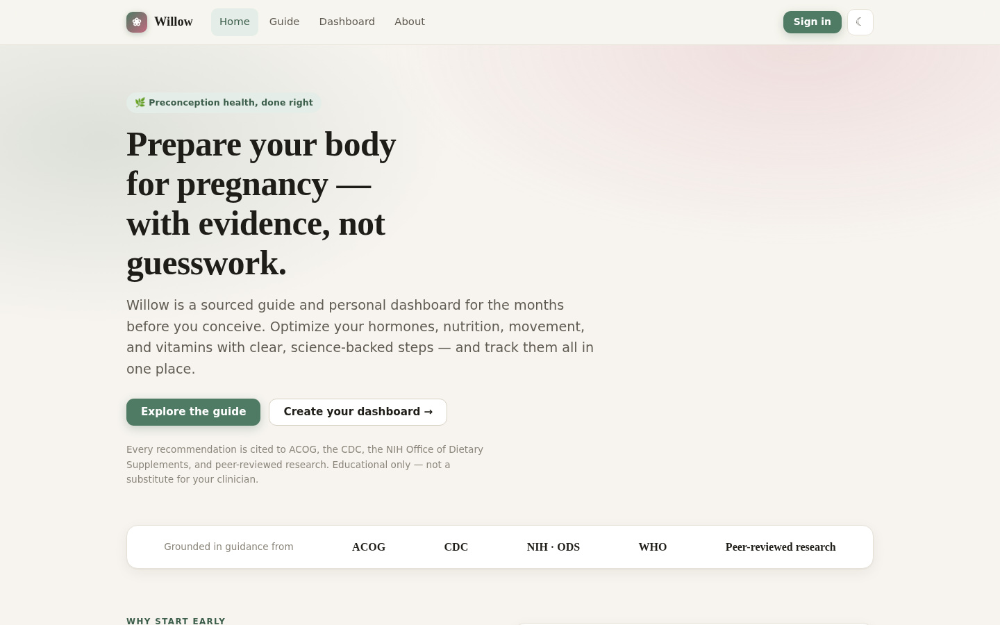
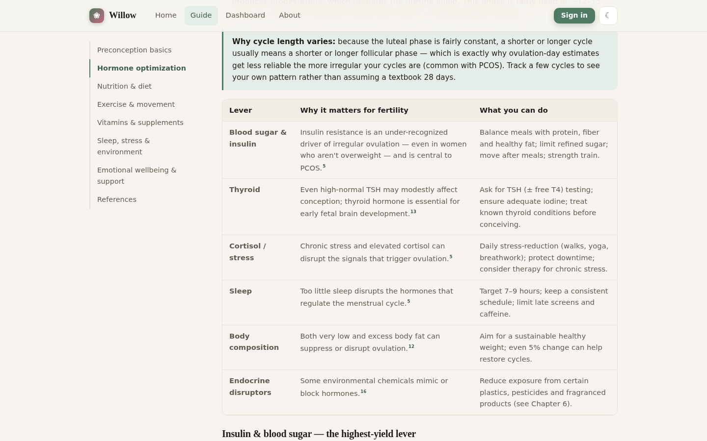
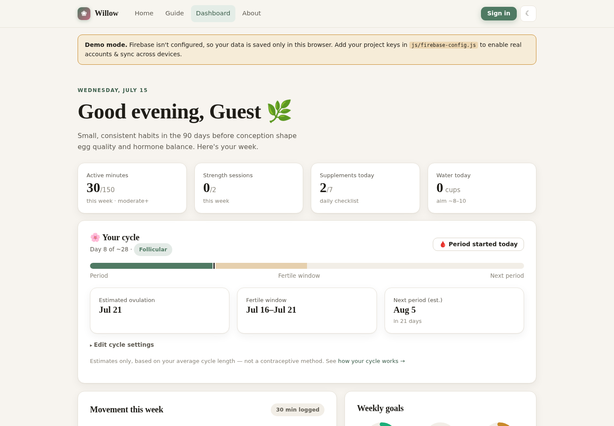
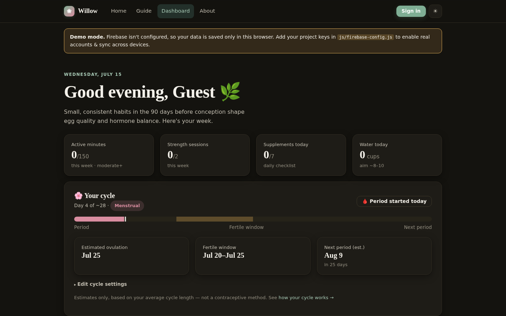

<div align="center">

# 🌿 Willow

**An evidence-based preconception health guide & personal dashboard**

[](#)
[](#)
[](#)
[](#)
[](LICENSE)

[**Live demo**](https://extinctmushroom.github.io/PrenatalHealthInfo/) · [Report an issue](https://github.com/extinctmushroom/PrenatalHealthInfo/issues)



</div>

## Overview

Willow is a knowledge base, guide, and personal dashboard for the months before
pregnancy. It pairs a **fully-cited, seven-chapter guide** — hormone
optimization, your menstrual cycle, nutrition, exercise, vitamins, and
emotional wellbeing — with a **tracking dashboard** that turns that guidance
into daily habits: a cycle tracker, an exercise log, a supplement checklist,
meal logging, and progress toward weekly goals.

Every recommendation in the guide links to a source — ACOG, the CDC, the NIH
Office of Dietary Supplements, the WHO, or peer-reviewed research — rather than
asserting it. It's built as a static site with no backend and no build step,
deployed on GitHub Pages, using Firebase for authentication and per-user data.

> **Educational only, not medical advice.** Willow summarizes public health
> guidance for education. It creates no clinician–patient relationship —
> always consult a qualified healthcare professional about your own care.

## Screenshots

<table>
<tr>
<td width="50%">

**The guide** — cited, chapter-by-chapter


</td>
<td width="50%">

**The dashboard** — cycle, movement, and supplement tracking


</td>
</tr>
</table>

<div align="center">

</div>

## Features

**The guide** — seven chapters, every claim cited:

| Chapter | Covers |
|---|---|
| 1. Preconception basics | Checkups, folic acid timing, the 90-day window, and an FAQ on time-to-conceive timelines, birth control, and irregular cycles |
| 2. Hormone optimization | A menstrual-cycle-and-hormones explainer, plus insulin, thyroid, cortisol, sleep, body composition, and endocrine disruptors |
| 3. Nutrition & diet | A fertility-supportive eating pattern and key nutrients |
| 4. Exercise & movement | How much and what type, with PCOS-specific guidance |
| 5. Vitamins & supplements | Doses and food sources, checked against current NIH ODS fact sheets |
| 6. Sleep, stress & environment | The lifestyle levers that quietly shape hormones |
| 7. Emotional wellbeing & support | TTC-related stress, when to seek support, and a verified resources table (crisis line, infertility and postpartum support organizations) |

**The dashboard** (account-gated):

- 🌸 **Cycle tracker** — logs your last period and average cycle length, then computes cycle day, phase, fertile window, and estimated next period
- 🏃 **Exercise tracker** — an inline-SVG weekly chart plus evidence-based workout suggestions
- 💊 **Supplement checklist** — daily targets for folate, vitamin D, omega-3, iodine, choline, and more
- 🥗 **Meal logging** — nutrient-focused meal ideas you can log in a tap
- 💧 **Water tracker** and daily notes for energy, sleep, and symptoms
- 🎯 **Progress rings & stat tiles** against weekly goals

**Accounts & data:**

- Firebase Authentication (email + password) with a username display name
- Cloud Firestore for private, per-user data, enforced by security rules
- Runs in a local **demo mode** before Firebase is configured, so the whole app is explorable with zero setup

**Design:**

- Warm, accessible light/dark theme with no build step or dependencies
- Skip-to-content link, visible focus states, `prefers-reduced-motion` support
- Pre-paint theme application (no flash of the wrong theme) and graceful offline fallback if the Firebase SDK can't load

## Getting started

Clone the repo and serve it with any static file server — there's no build
step:

```bash
git clone https://github.com/extinctmushroom/PrenatalHealthInfo.git
cd PrenatalHealthInfo
python3 -m http.server 8000
# then open http://localhost:8000
```

> Use a local server rather than opening `index.html` directly from the file
> system, so the ES module imports and Firebase SDK load correctly.

Without any further setup, the dashboard runs in **demo mode** (data saved to
your browser only) — everything else works immediately.

## Firebase setup (optional — enables real accounts)

1. Create a project at the [Firebase console](https://console.firebase.google.com).
2. Add a Web App and copy its config object.
3. Paste the values into [`js/firebase-config.js`](js/firebase-config.js):
   ```js
   export const firebaseConfig = {
     apiKey: "…",
     authDomain: "yourproject.firebaseapp.com",
     projectId: "yourproject",
     storageBucket: "yourproject.appspot.com",
     messagingSenderId: "…",
     appId: "…",
   };
   ```
   > These web keys are not secrets — Firebase web API keys are designed to be
   > public. Data is protected by Firestore **security rules**, not the key.
4. **Authentication → Sign-in method** → enable **Email/Password**.
5. **Firestore Database** → create a database, then open the **Rules** tab and
   publish the contents of [`firestore.rules`](firestore.rules).
6. **Authentication → Settings → Authorized domains** → add your GitHub Pages
   domain (e.g. `your-username.github.io`).

## Deployment

This is a plain static site, so GitHub Pages can serve it directly with no
build step. Enable it under **Settings → Pages → Build and deployment →
Source: "Deploy from a branch"**, then pick `main` and `/ (root)`. GitHub
rebuilds and redeploys automatically on every push to `main` — no workflow
file needed.

## Project structure

```
.
├── index.html              # Landing page
├── guide.html               # The sourced knowledge base (7 chapters + references)
├── dashboard.html           # Account-gated tracking dashboard
├── login.html                # Sign in / create account
├── about.html                # About, sourcing method, privacy, disclaimer
├── 404.html                   # Custom not-found page
├── css/
│   └── styles.css            # Design system (light/dark)
├── js/
│   ├── layout.js              # Shared header/footer, theme toggle, nav, skip link
│   ├── firebase-config.js     # ← your Firebase keys go here
│   ├── firebase-init.js       # Lazily-loaded Firebase app/auth/db instance
│   ├── auth.js                # Sign in / sign up / route guard
│   ├── dashboard.js           # Trackers, rings, weekly chart, storage adapters
│   ├── cycle.js                # Menstrual cycle date math
│   └── content.js              # Supplement, exercise & meal suggestion data
├── firestore.rules             # Security rules (paste into Firebase console)
└── assets/screenshots/          # README images
```

## Tech stack

Vanilla HTML, CSS, and JavaScript (ES modules) — no framework, no bundler, no
build step. Firebase Authentication and Cloud Firestore for accounts and data.
Deployed on GitHub Pages, served directly from `main`.

## License

MIT — see [LICENSE](LICENSE).

## Disclaimer

Willow summarizes public health guidance and research for **education only**.
It is not medical advice, diagnosis, or treatment, and creates no
clinician–patient relationship. Guidelines evolve and individual circumstances
vary — always consult a qualified healthcare professional about your own care.
See the full [references](guide.html#references) and
[disclaimer](about.html#disclaimer).
